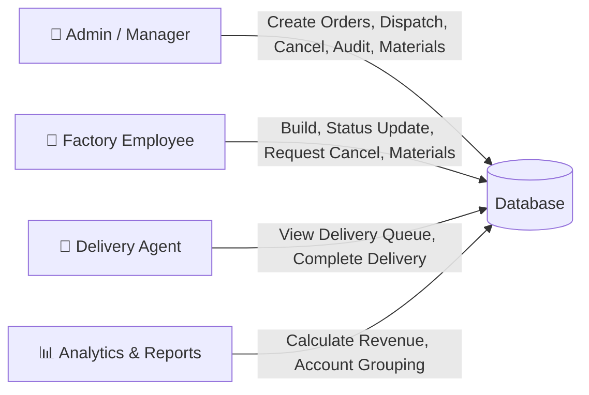
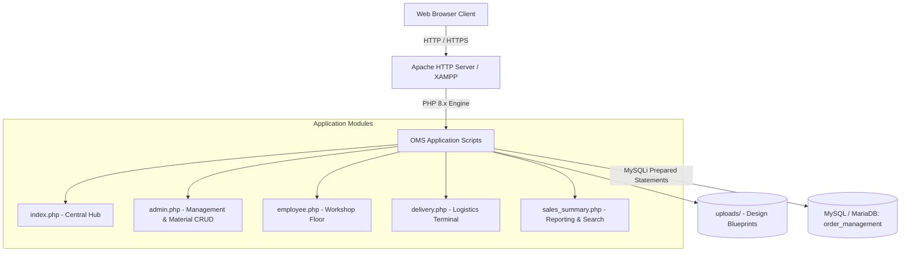
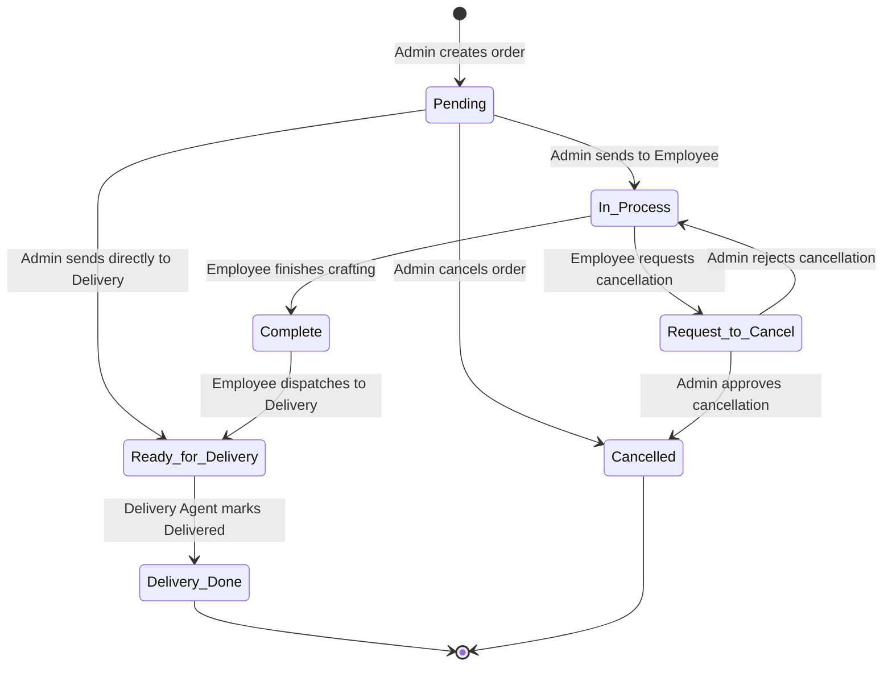
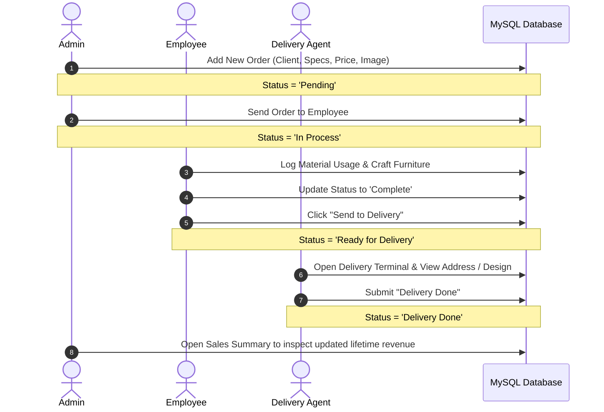
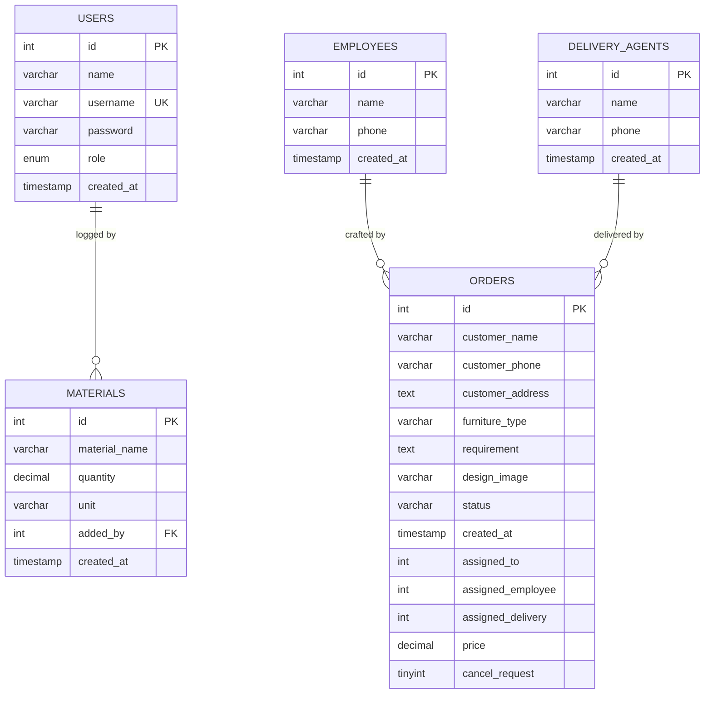

# Shanjer Crafts - Order Management System (OMS)
### Course: System Analysis and Design (CSE-3324)
#### Repository: Order-Management-System-for-SAD_CSE-3324

[](https://www.php.net/)
[](https://www.mysql.com/)
[](#license)
[](#system-architecture)

> **A comprehensive web-based Order, Material Inventory, Production, and Logistics Management System designed for custom craft, furniture manufacturing, and retail businesses.**

---

## 📑 Table of Contents
- [1. Executive Summary & System Overview](#1-executive-summary--system-overview)
- [2. System Analysis & Requirements](#2-system-analysis--requirements)
  - [2.1 Problem Statement](#21-problem-statement)
  - [2.2 Proposed Solution](#22-proposed-solution)
  - [2.3 Functional Requirements](#23-functional-requirements)
  - [2.4 Non-Functional Requirements](#24-non-functional-requirements)
  - [2.5 System Actors & Permissions](#25-system-actors--permissions)
- [3. System Architecture & Workflows](#3-system-architecture--workflows)
  - [3.1 High-Level Architecture](#31-high-level-architecture)
  - [3.2 Order Lifecycle State Machine](#32-order-lifecycle-state-machine)
  - [3.3 Production & Delivery Flowchart](#33-production--delivery-flowchart)
- [4. Database Design & Data Dictionary](#4-database-design--data-dictionary)
  - [4.1 Entity-Relationship Diagram (ERD)](#41-entity-relationship-diagram-erd)
  - [4.2 Database Schema & Tables](#42-database-schema--tables)
- [5. Implemented Features & Modules](#5-implemented-features--modules)
  - [5.1 Central Portal (`index.php`)](#51-central-portal-indexphp)
  - [5.2 Admin Control Center (`admin.php`)](#52-admin-control-center-adminphp)
  - [5.3 Production / Employee Panel (`employee.php`)](#53-production--employee-panel-employeephp)
  - [5.4 Logistics & Delivery Agent Panel (`delivery.php`)](#54-logistics--delivery-agent-panel-deliveryphp)
  - [5.5 Financial & Sales Analytics (`sales_summary.php`)](#55-financial--sales-analytics-sales_summaryphp)
  - [5.6 Real-Time Live Sync Engine](#56-real-time-live-sync-engine)
- [6. Technology Stack](#6-technology-stack)
- [7. Directory & File Structure](#7-directory--file-structure)
- [8. Installation & Setup Guide](#8-installation--setup-guide)
- [9. Security & Scalability Considerations](#10-security--scalability-considerations)
- [10. Authors & Acknowledgments](#11-authors--acknowledgments)

---

## 1. Executive Summary & System Overview

**Shanjer Crafts - Order Management System (OMS)** is a full-lifecycle operational suite built to handle bespoke carpentry, crafts, and custom furniture production. 

In custom crafting and furniture businesses, standard e-commerce models fail because each order involves:
1. **Custom Specifications & Blueprints**: Unique client requirements, measurements, and design image attachments.
2. **Raw Material Inventory Tracking**: Timber, foam, hardware, and fabrics consumed in real time.
3. **Multi-Stage Workflow Hand-offs**: From customer booking &rarr; factory workshop floor &rarr; logistics/delivery &rarr; delivery confirmation.
4. **Sales & Customer Loyalty Analytics**: Comprehensive tracking of completed revenue, order frequency, and customer order history grouped by name and phone number.

This system bridges the communication gap between management, factory artisans/employees, and delivery agents through dedicated role interfaces and background live-sync technology.

---

## 2. System Analysis & Requirements

### 2.1 Problem Statement
Traditional custom furniture enterprises rely heavily on manual paper registers, phone calls, or fragmented messaging apps. This causes:
- Lost or misinterpreted design blueprints and dimensions.
- Zero visibility into whether an order is being cut, assembled, polished, or out for delivery.
- Inaccurate material inventory leading to sudden production halts.
- Disconnected financial reporting where cancelled orders skew sales totals or completed revenue is tracked incorrectly.

### 2.2 Proposed Solution
A unified, responsive web portal where:
- Orders are logged with design images, financial pricing, and structured specs.
- Admins route orders to the factory floor or straight to delivery.
- Factory technicians update progress, manage stock, and initiate cancel requests with admin approval safeguards.
- Couriers/Delivery agents get a streamlined terminal to locate client addresses, view visual design specs, and mark items as "Delivery Done".
- Real-time DOM synchronization automatically updates dashboards without full page reloads.

### 2.3 Functional Requirements
| ID | Requirement | Handled In |
|:---|:---|:---|
| **FR-01** | Add new customer order with design image upload (JPG/PNG/WEBP). | `admin.php` |
| **FR-02** | Assign order to factory technician or directly to delivery courier. | `admin.php` |
| **FR-03** | Workshop employee updates production status (`In Process`, `Complete`). | `employee.php` |
| **FR-04** | Formal cancellation request lifecycle (Employee request &rarr; Admin approve/reject). | `employee.php`, `admin.php` |
| **FR-05** | Inventory management (Add, edit via modal, delete, and view raw materials). | `admin.php`, `employee.php` |
| **FR-06** | Dedicated delivery portal to view addresses, preview design, and complete delivery. | `delivery.php` |
| **FR-07** | Financial reporting: Lifetime sales, date-wise filtering, and all-orders view. | `sales_summary.php` |
| **FR-08** | Advanced customer lookup grouping orders by customer name and phone number. | `sales_summary.php` |
| **FR-09** | Live-sync background polling without screen blinking or input interruption. | `admin.php`, `employee.php`, `delivery.php` |

### 2.4 Non-Functional Requirements
- **Data Integrity**: Prepared SQL statements (`mysqli::prepare`) against SQL Injection.
- **Reliability & Auditability**: Soft cancellation preserves financial data for accounting instead of permanent database truncation.
- **Usability**: Clean responsive layout with sticky headers, color-coded status badges, and interactive modals.
- **Performance**: Lightweight vanilla code without heavy third-party framework overhead, rendering in milliseconds on low-power local servers.

### 2.5 System Actors & Permissions



| Role | Permitted Actions |
|:---|:---|
| **Admin** | Create orders, upload design blueprints, assign to employee, direct route to delivery, cancel orders, review cancel requests (approve/reject), manage raw materials, view sales analytics. |
| **Employee** | View assigned work orders, update production status to `In Process` or `Complete`, file cancellation requests with admin, dispatch completed furniture to delivery, manage materials. |
| **Delivery Agent** | View orders marked `Ready for Delivery`, view customer location, customer phone & furniture design, mark orders as `Delivery Done`. |

---

## 3. System Architecture & Workflows

### 3.1 High-Level Architecture



### 3.2 Order Lifecycle State Machine



### 3.3 Production & Delivery Flowchart



---

## 4. Database Design & Data Dictionary

### 4.1 Entity-Relationship Diagram (ERD)



### 4.2 Database Schema & Tables

#### 1. `orders` Table
| Column | Type | Nullable | Default | Description |
|:---|:---|:---|:---|:---|
| `id` | `INT(11)` | No | AUTO_INCREMENT | Unique primary order ID |
| `customer_name` | `VARCHAR(100)` | No | - | Full name of the customer |
| `customer_phone` | `VARCHAR(30)` | No | - | Customer contact phone number |
| `customer_address` | `TEXT` | No | - | Physical delivery destination |
| `furniture_type` | `VARCHAR(100)` | No | - | Category (e.g. Sofa, Dining Table, Wardrobe) |
| `requirement` | `TEXT` | No | - | Measurements, timber type, fabric color, notes |
| `design_image` | `VARCHAR(255)` | Yes | NULL | Stored filename in `uploads/` |
| `status` | `VARCHAR(50)` | No | `'Pending'` | Lifecycle stage badge |
| `created_at` | `TIMESTAMP` | No | `current_timestamp()` | Creation timestamp |
| `assigned_to` | `INT(11)` | Yes | NULL | General assignment pointer |
| `assigned_employee`| `INT(11)` | Yes | NULL | Employee ID currently manufacturing item |
| `assigned_delivery`| `INT(11)` | Yes | 0 | Flag indicating presence in delivery queue |
| `price` | `DECIMAL(12,2)`| No | 0.00 | Total agreed order bill in BDT (৳) |
| `cancel_request` | `TINYINT(1)` | No | 0 | Flag for pending cancellation review |

#### 2. `materials` Table
| Column | Type | Nullable | Default | Description |
|:---|:---|:---|:---|:---|
| `id` | `INT(11)` | No | AUTO_INCREMENT | Unique material identifier |
| `material_name` | `VARCHAR(100)` | No | - | Material name (e.g. Mahogany Wood, Varnish, Screws) |
| `quantity` | `DECIMAL(10,2)`| No | - | Remaining or added stock quantity |
| `unit` | `VARCHAR(50)` | No | - | Measurement unit (kg, pieces, feet, liters) |
| `added_by` | `INT(11)` | Yes | NULL | User ID who registered the stock |
| `created_at` | `TIMESTAMP` | No | `current_timestamp()` | Entry timestamp |

#### 3. `employees` & `delivery_agents` Tables
| Column | Type | Nullable | Default | Description |
|:---|:---|:---|:---|:---|
| `id` | `INT(11)` | No | AUTO_INCREMENT | Unique staff member ID |
| `name` | `VARCHAR(100)` | No | - | Name of employee or delivery personnel |
| `phone` | `VARCHAR(20)` | Yes | NULL | Emergency and dispatch contact number |
| `created_at` | `TIMESTAMP` | No | `current_timestamp()` | Staff onboarding timestamp |

---

## 5. Implemented Features & Modules

### 5.1 Central Portal (`index.php`)
- **Navigation Hub**: Direct entry points to Admin, Employee, Delivery, and Sales Summary panels.
- **KPI Summary Widgets**: Real-time summary tiles calculating:
  - *Total Orders* across all states.
  - *In Process* active workshop workload.
  - *Ready for Delivery* pending courier dispatch.
  - *Completed / Delivered* successful fulfillment.

### 5.2 Admin Control Center (`admin.php`)
- **Order Ingestion**: Add client details, furniture specifications, pricing, and upload design images (supported: `JPG`, `JPEG`, `PNG`, `WEBP`).
- **Order Dispatching Engine**:
  - Send to Employee: sets order to `In Process` and routes to factory view.
  - Send Directly to Delivery: for ready-made stock bypasses production straight to courier.
- **Cancellation Request Queue**:
  - Dedicated table tracking cancel requests submitted from the factory floor.
  - **Remove Order**: Approves request, sets status to `Cancelled`, and preserves record for audit.
  - **Reject Request**: Rejects cancellation, reverting order back to `In Process`.
- **All Orders Master Table**: Sticky headers, color-coded badges, visual design thumbnails, and direct quick actions.
- **Latest Order Spotlight**: Full preview card showing high-res blueprint images and detailed requirements.
- **Raw Material Inventory Management**:
  - Full CRUD operations (Create, Read, Update, Delete).
  - Modern centered Modal Dialog for fast inline material updating without leaving the page.

### 5.3 Production / Employee Panel (`employee.php`)
- **Assigned Queue**: Lists only orders allocated to workshop production.
- **Status Workflow Controller**: Technicians can update order state to:
  - `In Process` (Production ongoing)
  - `Complete` (Finished crafting)
  - `Request to Cancel` (Material deficit or customer change request)
- **Safe Cancellation Submission**: Generates an alert flag to Admin with disable state prevention against double submissions.
- **Direct Dispatch to Logistics**: One-click "Send to Delivery" button enabled only after an order is marked `Complete`.
- **Workshop Material Access**: Factory workers can monitor and record material stocks alongside the admin.

### 5.4 Logistics & Delivery Agent Panel (`delivery.php`)
- **Focused Delivery Queue**: Filtered exclusively for orders flagged with `assigned_delivery = 1`.
- **Comprehensive Delivery Details**: Client address, contact phone, ordered item, and visual design blueprint.
- **Delivery Confirmation**: One-click "Delivery Done" button that transitions status to `Delivery Done`, automatically updating lifetime revenue metrics.

### 5.5 Financial & Sales Analytics (`sales_summary.php`)
- **All-Time Lifetime Overview**:
  - Total Lifetime Sales: `SUM(price)` calculated strictly for verified orders (`Complete` & `Delivery Done`).
  - Total Delivered Orders count.
  - Total Orders Placed count.
- **Date-Wise Inspection**:
  - Datepicker to select any past, current, or future date.
  - Instant "Today" shortcut button.
  - Daily sales metrics and complete order listing for that specific calendar day.
- **View All Orders Mode**: One-click view of all orders in the entire system.
- **Customer Account Grouping & Multi-Order Search Engine**:
  - Search by customer name or phone number.
  - **Account Grouping**: Automatically groups recurring orders by customer (Name + Phone).
  - Shows total orders per customer, total spend (BDT ৳), and breakdown of order statuses (`#12, #15, #19`).

### 5.6 Real-Time Live Sync Engine
Every operational dashboard (`admin.php`, `employee.php`, `delivery.php`) includes an asynchronous, non-intrusive polling script:
```javascript
// Polls every 2500ms using DOMParser
// Only replaces mutated table DOM nodes if data changes
// Pauses automatically when modals are open or users are typing
```
- Eliminates page flicker and retains user scroll positions.
- Guarantees that when an employee finishes an order, the delivery panel updates without manual refresh.

---

## 6. Technology Stack

- **Server-Side**: PHP 8.x (Prepared Statements, Object-Oriented MySQLi, File Upload Validations)
- **Database**: MySQL 5.7+ / MariaDB 10.4+ (InnoDB Engine, utf8mb4 encoding)
- **Front-End**: HTML5 Semantic Markup, Custom Responsive Vanilla CSS3, Grid & Flexbox
- **Client-Side Scripts**: Vanilla JavaScript (ES6+, `fetch` API, DOMParser, Modal controllers)
- **Development Environment**: XAMPP (Apache + MySQL), VS Code / Antigravity IDE

---

## 7. Directory & File Structure

```text
oms/
│
├── admin.php             # Admin Dashboard: Order management, dispatching, cancel requests, materials CRUD
├── employee.php          # Factory Floor Dashboard: Production updates, material logging, delivery dispatch
├── delivery.php          # Delivery Terminal: Courier delivery queue, address lookup, delivery completion
├── sales_summary.php     # Financial Analytics: Lifetime revenue, date filters, customer account search
├── index.php             # Main Landing Hub & Quick KPI overview
├── db.php                # Centralized MySQL database connection credentials
├── style.css             # Unified modern styles, tables, cards, badges, and layout rules
├── database.sql          # Turnkey SQL database export & table structures
├── .gitignore            # Git exclusion rules for temp logs and OS metadata
│
└── uploads/              # Uploaded furniture design images and customer blueprints
    └── .gitkeep          # Keeps directory tracked in version control
```

---

## 8. Installation & Setup Guide

### Prerequisites
- Install **XAMPP** (or WampServer / LAMP) with **PHP 8.0+** and **MySQL / MariaDB**.
- A web browser (Google Chrome, Firefox, Microsoft Edge).

### Step-by-Step Setup

1. **Clone or Copy Repository**:
   Copy the `oms` folder into your local web root directory:
   - For XAMPP (Windows): `C:\xampp\htdocs\oms`
   - For XAMPP (macOS): `/Applications/XAMPP/xamppfiles/htdocs/oms`
   - For Linux (LAMP): `/var/www/html/oms`

2. **Start Services**:
   Open **XAMPP Control Panel** and start both **Apache** and **MySQL**.

3. **Import Database Schema**:
   - Open your browser and navigate to `http://localhost/phpmyadmin/`.
   - Click **New** on the left panel to create a database.
   - Name it: `order_management` (Collation: `utf8mb4_general_ci`).
   - Click on the **Import** tab at the top.
   - Choose file: `C:\xampp\htdocs\oms\database.sql`.
   - Click **Import** / **Go** at the bottom.

4. **Verify Database Configuration (`db.php`)**:
   Ensure `db.php` matches your local MySQL credentials:
   ```php
   $host = "localhost";
   $username = "root";
   $password = "";
   $database = "order_management";
   ```

5. **Launch Application**:
   Open your browser and navigate to:
   ```text
   http://localhost/oms/
   ```

---

## 9. Security & Scalability Considerations

1. **SQL Injection Protection**: All dynamic user-submitted inputs are sanitized through PHP's parameterized prepared statements (`$conn->prepare()`, `bind_param()`, and `execute()`).
2. **Cross-Site Scripting (XSS) Prevention**: All dynamic HTML outputs are passed through `htmlspecialchars()` to prevent script injection.
3. **File Upload Hardening**: File uploads enforce strict extension whitelisting (`jpg`, `jpeg`, `png`, `webp`) and rename files using random timestamps + unique identifiers (`uniqid()`) to prevent directory traversal and overwrite attacks.
4. **Soft Deletions for Analytics**: Cancelled orders are preserved with status `'Cancelled'` rather than deleted from MySQL, ensuring that audit trails and accounting summaries remain intact.

---

## 10. Authors & Acknowledgments

- **Project**: Order-Management-System-for-SAD_CSE-3324
- **Developed for**: Shanjer Crafts & Custom Woodworking
- **Project Type**: Enterprise Order Management & Production Tracking System
- **Academic Course**: System Analysis & Design (SAD - CSE-3324)

---

*Made with ❤️ for efficient craftsmanship and manufacturing operations.*
